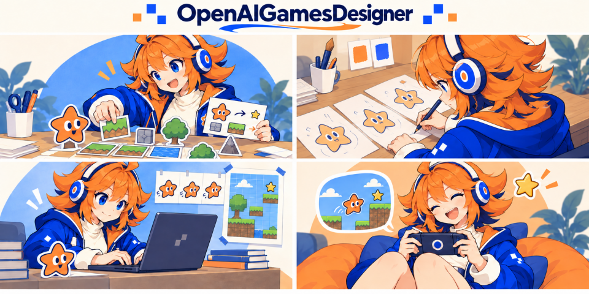
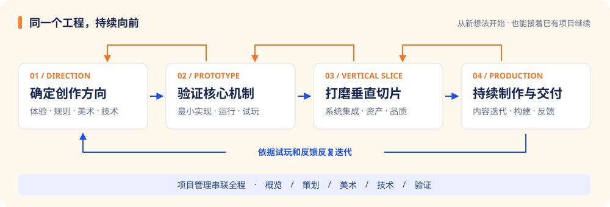
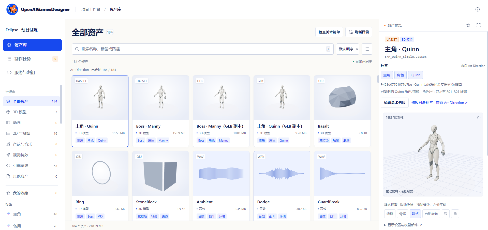

<div align="center">

# OpenAIGamesDesigner

AI 游戏开发工具包：涵盖游戏设计、美术、工程实施与验证，
从新想法走向原型、垂直切片与持续迭代。

[快速开始](#快速开始) · [开发流程](#开发流程) · [项目看板](#项目看板) · [游戏资产合集](#游戏资产合集) · [引擎与工具](#引擎与工具) · [项目文件](#项目文件)

</div>

## 从你正在做的事开始

<table>
<tr>
<td width="50%" valign="top">
<h3>💡 把想法变成开发方向</h3>
<p>从一句描述开始，澄清核心体验、玩法、美术与制作条件，把已知、待定和下一步保存在项目里。</p>
</td>
<td width="50%" valign="top">
<h3>🎮 制作原型与垂直切片</h3>
<p>把设计拆成任务，在选定的引擎里实现；通过实际运行与试玩，检验机制和代表性体验。</p>
</td>
</tr>
<tr>
<td width="50%" valign="top">
<h3>🔧 接着已有项目继续做</h3>
<p>新增系统、调整规则、修改关卡。沿用现有工程，让受影响的策划、美术与技术记录一起更新。</p>
</td>
<td width="50%" valign="top">
<h3>🎨 协作制作资产与数值</h3>
<p>明确资产需求，按需制作可编辑的美术图板、检索素材并接入制作工具；整理数值表，比较修改、回写工程并检查实际效果。</p>
</td>
</tr>
</table>

## 开发流程



可以从新想法开始，也可以直接进入已有项目的一次修改。项目管理串联**概览、策划、美术、技术与验证**，按当前任务调用专业方法。

重要创作取舍由你决定，AI 在已确定的范围内推进。设计、工程改动和实际验证分别记录，后续对话可以沿着项目文件继续工作。

<details>
<summary>查看六条工作流与专业入口</summary>

| 这次想完成什么 | 工作流 |
| --- | --- |
| 立项 / 接手已有项目 | [项目接入](workflows/project-intake.md) |
| 验证核心机制 | [原型构建](workflows/prototype-build.md) |
| 集成代表性体验与品质 | [垂直切片](workflows/vertical-slice.md) |
| 新增、修改或移除功能 | [功能变更](workflows/feature-change.md) |
| 制作、处理与导入资产 | [资产制作](workflows/asset-production.md) |
| 打包交付与反馈接续 | [交付](workflows/delivery.md) |

相关 Skills：[项目管理](skills/game-preproduction/SKILL.md) · [概览与定位](skills/game-concept/SKILL.md) · [游戏策划](skills/game-design/SKILL.md) · [美术方向](skills/game-art-direction/SKILL.md) · [技术设计](skills/game-technical-design/SKILL.md) · [原型验证](skills/game-prototype-validation/SKILL.md)

</details>

## 快速开始

本指南提供 **Codex** 的安装与使用方法。准备 Python 3.10+ 运行工具；实际制作时，再接入项目需要的引擎和资产工具。

先查 [按功能配置环境](adapters/environment-setup.md)：列出需要安装什么、在电脑 / 引擎 / AI 助手的哪里配置，以及怎样确认可用。只讨论和维护设计文档时无需先安装引擎。

### 1 · 获取并安装

使用有仓库访问权限的账号获取本仓库，在 Codex 中打开，然后输入：

```text
把这个仓库的六个 Skill 和必要运行资源安装到本机。
如果已有同名版本，先比较差异并保留我的修改。
```

<details>
<summary>手动获取、打包与安装</summary>

```sh
git clone https://github.com/openaigames/OpenAIGamesDesigner.git
cd OpenAIGamesDesigner
python tools/package_skills.py --output dist/skills-bundle
```

Codex 个人安装：将生成包中的六个完整 Skill 目录放入 `~/.agents/skills/`（Windows 默认是 `C:/Users/<用户名>/.agents/skills/`）。仅供某个游戏项目使用时，可放入该项目的 `.agents/skills/`；通常选择一种范围，避免同名副本混淆。保留 `game-preproduction/runtime/` 等全部子文件，已有同名目录时先比较并备份本地修改。

打包目标需为新目录；更新后重新打包并同步安装副本。包内 `game-preproduction/runtime/bundle-manifest.json` 记录内容版本，使用该 runtime 下的 `tools/check_installation.py --skills-root <六个Skill的父目录>` 检查缺失或修改的文件；差异需比较并保留本地定制。分发包不包含引擎、生成模型或游戏资产。

</details>

### 2 · 打开你的游戏项目

安装后在 Codex 新开一个任务，以游戏项目目录为工作目录，或提供已有工程的实际路径。已有项目沿用自己的结构。Skill 安装位置、MCP 配置与游戏项目文件是不同位置，见 [Codex 路径速查](adapters/environment-setup.md#codex-路径速查)。

### 3 · 用自然语言描述目标

**开始一个新游戏**

```text
我想做一个网页 2D 探索游戏，使用 Phaser。
玩家可以收集零件、修复设施，逐步进入新的区域。
先帮我确定核心体验和第一版原型的范围。
```

**继续一个已有项目**

```text
给这个游戏增加装备升级系统，使用探索获得的资源。
先讨论规则和对现有系统的影响，再推进实现。
```

直接描述目标即可。助手根据资料澄清关键未知，选择适用的 Skill，在项目文件中保存决定并继续工作。

[完整使用说明 →](tools/README.md)

## 项目看板

**在浏览器里浏览游戏目录中的资产、核对3D模型生成任务、配置3D模型API Key。**



直接告诉助手：

```text
打开这个游戏项目的看板，我要浏览本地资产。
```

有游戏目录后即可使用，无需先完成美术登记。看板按需打开，不会因为创建了项目就自动启动。也可在工具包根目录运行以下命令；安装版从 `game-preproduction/runtime/` 运行：

```sh
python tools/project_workbench.py --project "游戏项目绝对路径"
```

服务启动后会打开浏览器。同一台电脑上的其他浏览器可使用相同的本机网址；服务需保持运行，重启后地址可能变化。本地资产浏览不需要 API Key。

| 页面 | 可以做什么 |
| --- | --- |
| **资产库** | 扫描支持格式的文件，按类型、目录、名称和标签查找；切换网格或列表、收藏、预览及查看来源与许可 |
| **制作任务** | 查看资产生成请求、确认状态和结果；准备 Tripo / 混元 3D 文本生成任务，核对后授权，由助手执行 |
| **服务与密钥** | 配置生成服务；Windows 支持当前用户的本机加密保存，其他系统使用环境变量。保存配置不会启动生成 |

### 资产预览范围

| 资产 | 当前支持 |
| --- | --- |
| GLB / glTF | 旋转、缩放、平移、线框、骨骼与部件查看；文件含动画时可选择片段、播放和调整进度 |
| OBJ | 直接查看几何；读取模型引用的项目内 MTL 和贴图，缺少材质时使用中性材质 |
| 图片、音频、视频 | 常见图片格式的缩放与平移、音频播放和波形、视频播放；实际解码取决于浏览器支持 |
| VFX | 预览看板支持的 `.vfx.json` 粒子配置及贴图；引擎原生特效需另行导出视频或其他可浏览形式 |
| 引擎资源与其他模型格式 | 列出文件信息；UE 等引擎模型可导出 GLB 并关联原资源卡片，FBX、STL 等尚不直接渲染 |

关联预览需要先从原制作工具或引擎导出，并记录源文件与依赖版本。源资源变化后，旧预览会失效；浏览器画面可能与引擎材质、场景效果不同。动画分类统计已读取到动画片段的文件，未导出的引擎动作文件仍列在“引擎资源”。

### 标签跟随美术记录

`Art Direction.md` 统一保存对象与标签。主角的模型、贴图、动画、音效和 VFX 可以归属同一对象，共享“主角”等标签，并在看板中筛选。

固定程序扫描文件、计算版本并对照美术记录；“检查美术清单”列出未登记、归属或标签缺项、文件缺失及版本变化。AI 助手依据项目资料补齐用途和归属，未知内容保留待确认。看板不会自行调用模型判断用途，也没有后台目录监听；新增或修改文件后点击“刷新目录”。

[看板启动与命令说明 →](tools/README.md#项目看板与资产核查) · [标签与关联预览说明 →](skills/game-preproduction/references/project-workbench.md)

## 游戏资产合集

合集覆盖 2D、3D、动画、VFX、音频、字体与引擎模块，并标注免费与付费情况。以下为部分来源：

| 来源 | 主要内容 | 是否付费 |
| --- | --- | --- |
| [Kenney](https://kenney.nl/assets) | 2D、3D、UI、音效 | 单独资源包免费，整合包付费 |
| [Quaternius](https://quaternius.com/) | 低多边形 3D、角色、动画 | 部分免费，扩展版本付费 |
| [Poly Haven](https://polyhaven.com/) | 3D、PBR 材质、HDRI | 公开资产免费 |
| [Effekseer](https://effekseer.github.io/en/contribute.html) | VFX 示例效果 | 免费 |
| [Freesound](https://freesound.org/) | 音效、环境声音 | 免费，需登录 |
| [Fab](https://www.fab.com/) | 模型、动画、VFX、音频、引擎模块 | 免费与付费均有 |

[查看完整资产合集、收费说明与获取步骤 →](adapters/assets/asset-sources.md)

## 引擎与工具

按项目目标选择制作路线，已有工程优先沿用。

| 制作路线 | 接入文件 |
| --- | --- |
| **Three.js · 网页 3D** | [adapters/engines/threejs/README.md](adapters/engines/threejs/README.md) |
| **Phaser · 网页 2D** | [adapters/engines/phaser/README.md](adapters/engines/phaser/README.md) |
| **Godot** | [adapters/engines/godot/README.md](adapters/engines/godot/README.md) |
| **Unity** | [adapters/engines/unity/README.md](adapters/engines/unity/README.md) |
| **Unreal Engine** | [adapters/engines/unreal/README.md](adapters/engines/unreal/README.md) |

资产制作支持 [Tripo / Hunyuan3D API](adapters/assets/generation-api.md)（[本机密钥设置页](adapters/assets/local-settings.md)）、[资产检索与登记](adapters/assets/asset-sources.md)，以及图像、音频与 Blender 的本地命令；数值协作支持已绑定 JSON 配置与 CSV / Excel 数值页之间的交换。

Unity 与 Unreal 分别提供工程创建、场景与组件编辑、资源导入、角色动画配置及自动操作入口，通过会话记录关联检查点和中断恢复。编辑器操作也可使用宿主已有的 MCP，具体支持范围与依赖见各引擎说明。

[引擎接入说明](adapters/README.md) · [资产工具接入](adapters/assets/README.md) · [数值表往返](tools/README.md#数值表往返) · [验证方法](tests/README.md)

## 项目文件

### 工具包目录

```text
OpenAIGamesDesigner/
├── skills/                         # AI 专业工作方法与按需参考
│   ├── game-preproduction/         # 项目管理、阶段推进与变更协调
│   ├── game-concept/               # 游戏定位、核心体验与设计支柱
│   ├── game-design/                # 玩法、系统、关卡与数值策划
│   ├── game-art-direction/         # 美术方向、图板、素材选用与视觉验收
│   ├── game-technical-design/      # 技术设计、工程实施与引擎参考
│   └── game-prototype-validation/  # 原型、切片与变更验证
├── workflows/                      # 立项、原型、切片、变更、资产与交付流程
├── templates/                      # 项目管理、里程碑、任务和规格等交付模板
├── tools/                          # 项目看板、项目执行、资产任务、数值交换与检查
├── adapters/                       # 具体引擎及外部工具的接入实现
│   ├── engines/                    # 引擎运行、制作、会话恢复与 MCP 接入约定
│   │   ├── godot/                  # Godot 命令与接入说明
│   │   ├── unity/                  # Unity 运行、制作驱动与 C# 辅助工具
│   │   ├── unreal/                 # UE 运行、制作驱动与 Python 辅助工具
│   │   ├── threejs/                # 网页 3D
│   │   └── phaser/                 # 网页 2D
│   ├── assets/                     # 生成 API、素材检索下载与本地处理
│   └── processing/                 # Blender 等资产处理接入
├── schemas/                        # 项目、运行、引擎会话、资产任务与产物记录约定
├── tests/                          # 自动检查、行为场景与联调样例
└── dist/                           # 本地打包生成的 Skill 分发包
```

### 新游戏项目目录

**讨论、设计与工程留在你的游戏项目里。** 六份方向文档作为入口，详细规格、任务、资产和运行证据按需建立，通过链接关联。

```text
MyGame/
├── Project Management.md       # 阶段、索引、变更汇总与下一步
├── Game Concept.md             # 定位、核心体验与设计支柱
├── Game Design Document.md     # 玩法、系统与数值设计入口
├── Art Direction.md            # 美术方向、表现与资产记录
├── Technical Design.md         # 技术方案、接口与工程入口
├── Risk & Assumption List.md   # 风险、验证计划与实际结果
├── design/                     # 详细功能、资产规格与数值设计
├── production/                 # 任务、里程碑与重要决定
├── assets-source/              # 源素材或外部资产引用
├── game/                       # 可持续编辑的游戏工程
├── tests/                      # 测试与试玩报告
├── .openaigame/                # 工具配置与任务记录
├── runs/                       # 执行日志、输入快照与证据
└── builds/                     # 构建产物
```

初次立项保存已知信息，未确定的记录为待讨论。后续只修改当前任务涉及的专业内容，关联变更汇总到项目管理；定位发生变化时再更新概览。

具体资产、来源、许可与交付进度由美术记录或现有资产清单统一维护，概览只保留影响定位的制作策略摘要。

已有项目保留自己的目录和等价文档。游戏资料保存在项目中，Skill 安装目录保存通用方法与工具。

## 扩展与参与

[专业 Skills](skills/) · [工作流与架构](workflows/README.md) · [交付模板](templates/) · [适配器](adapters/README.md) · [测试与验证](tests/README.md)

专业方法放在对应 Skill，具体工具接入放在适配器，通用流程负责串联。欢迎通过实际项目中的需求与验证结果，逐步完善这套工具。
