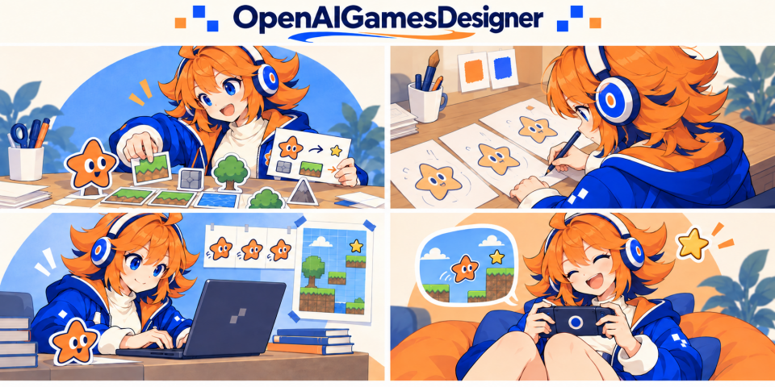
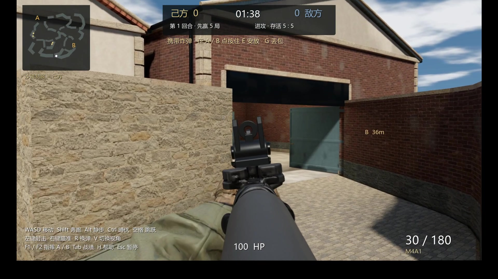
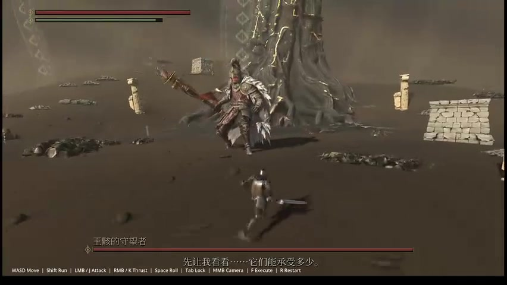
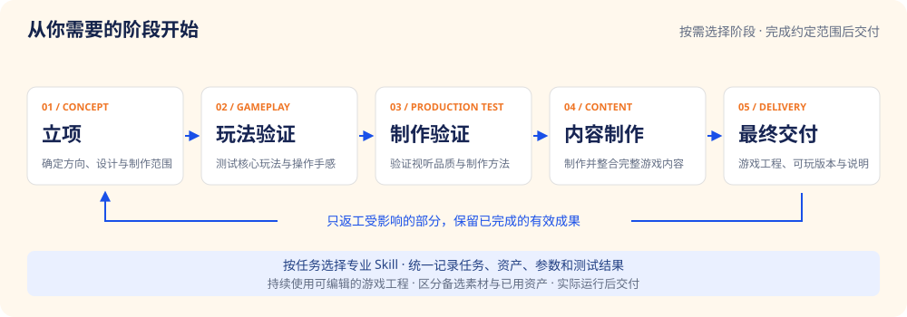
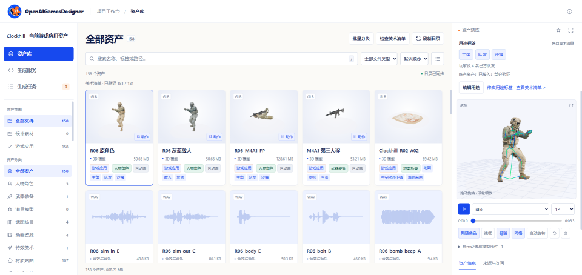
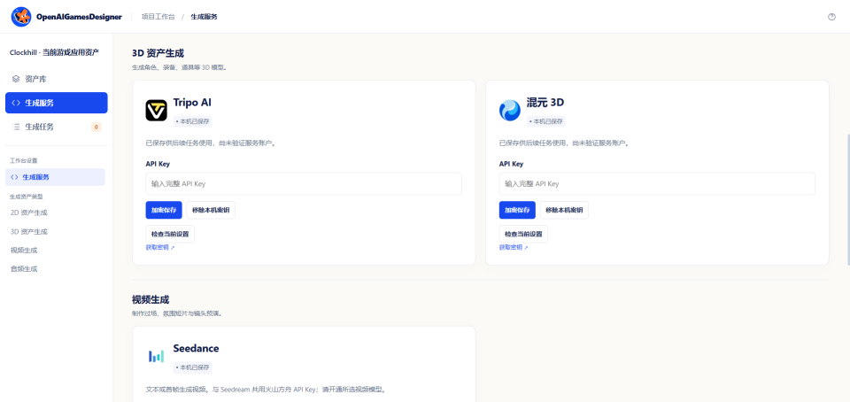

<div align="center">

# OpenAIGamesDesigner：AI游戏开发工具包

**OpenAIGamesDesigner 为 Agent 提供游戏制作的方法与工具，帮助你从想法推进到可玩的游戏。**

> **OpenAIGamesDesigner** 包含 **16 个游戏制作 Skill**，覆盖策划、美术、动画、音频、程序与测试，并提供 **五阶段推荐流程、素材检索、资产登记与版本管理、项目看板**。配有 **Godot、Unity、Unreal Engine、Three.js 和 Phaser** 的工程接入与运行验证工具，可结合 **Blender** 处理资产，并通过外部生成服务制作 **图像、3D 模型、视频和音频**。

**[Game Demos](#game-demos) · [推荐开发流程](#推荐开发流程) · [快速开始](#快速开始) · [项目看板](#项目看板) · [游戏资产合集](#游戏资产合集) · [引擎与工具](#引擎与工具) · [项目文件](#项目文件)**

</div>

<br>

## Game Demos

使用工具包制作的游戏实机演示

<table>
<tr>
<td width="50%" valign="top" align="center">
<h3>FPS Game</h3>
<a href=".github/assets/game-demo-fps.mp4"></a>
</td>
<td width="50%" valign="top" align="center">
<h3>Action Game</h3>
<a href=".github/assets/game-demo-action.mp4"></a>
</td>
</tr>
</table>

<br>

## 推荐开发流程



五个阶段为 **立项 → 玩法验证 → 制作验证 → 内容制作 → 最终交付**。你可以从已有工程、素材、设计稿或新想法出发，从任一阶段开始，按需要完成一个或多个连续阶段。开始前确认所需资料和工具，完成约定范围后交付成果。遇到问题时，只返工受影响的部分，继续使用现有游戏工程。

重要的创作选择由你决定，Agent 在已确定的范围内推进。设计决定、工程改动和测试结果保存在项目文件中，方便后续继续开发。

<details>
<summary>查看各阶段的工作流程与专业 Skill</summary>

| 这次想完成什么 | 工作流 |
| --- | --- |
| 立项 / 接手已有项目 | [项目接入](workflows/project-intake.md) |
| 验证核心机制 | [原型构建](workflows/prototype-build.md) |
| 制作展示核心玩法和目标品质的可玩片段 | [垂直切片](workflows/vertical-slice.md) |
| 新增、修改或移除功能 | [功能变更](workflows/feature-change.md) |
| 制作、处理与导入资产 | [资产制作](workflows/asset-production.md) |
| 打包交付，并根据反馈继续改进 | [交付](workflows/delivery.md) |
| 选择开发阶段与完成标准 | [五阶段定义](workflows/development-stages.md) · [阶段任务执行](workflows/stage-execution.md) |
| 从可玩片段扩展到完整游戏内容 | [内容制作](workflows/content-production.md) |

各专业 Skill：[制作管理](skills/game-preproduction/SKILL.md) · [创意与定位](skills/game-concept/SKILL.md) · [系统策划](skills/game-design/SKILL.md) · [数值策划](skills/game-numerical-design/SKILL.md) · [战斗策划](skills/game-combat-design/SKILL.md) · [关卡策划](skills/game-level-design/SKILL.md) · [美术指导](skills/game-art-direction/SKILL.md) · [角色美术](skills/game-character-art/SKILL.md) · [场景美术](skills/game-environment-art/SKILL.md) · [动画](skills/game-animation-pipeline/SKILL.md) · [特效](skills/game-vfx-design/SKILL.md) · [音频](skills/game-audio-design/SKILL.md) · [UI/UX](skills/game-ui-ux/SKILL.md) · [技术美术](skills/game-technical-art/SKILL.md) · [技术与工程](skills/game-technical-design/SKILL.md) · [验证](skills/game-prototype-validation/SKILL.md)。每项可单独使用，也可以按任务组合使用，无需为每个专业单独启动 Agent 或创建一套文档。

</details>

<br>

## 快速开始

下载并解压本仓库，或使用以下命令获取工具包：

```sh
git clone https://github.com/openaigames/OpenAIGamesDesigner.git
cd OpenAIGamesDesigner
```

准备 Python 3.10+，游戏引擎和资产制作工具按项目需要配置；Skill 安装方式以所用 Agent 的要求为准。

<details>
<summary>可选：打包并安装到支持 Skill 的 Agent</summary>

在工具包根目录运行：

```sh
python tools/package_skills.py --output dist/skills-bundle
```

将分发包的完整内容（十六个 Skill 目录和包根目录 `LICENSE`）放入所用 Agent 支持的个人或项目 Skill 目录，保留 `game-preproduction/runtime/` 等全部子文件。安装后按该 Agent 的方式重新加载 Skill。

打包目标需为新目录。更新已有安装时，先逐文件比较并备份本地修改，保留其他 Skill 和个人文件，不整体替换安装根目录。包内 `game-preproduction/runtime/bundle-manifest.json` 记录内容版本。

从安装后的 `game-preproduction/runtime/` 目录运行完整性检查：

```sh
python tools/check_installation.py --skills-root "Skill 安装根目录的绝对路径"
```

`missing`、`changed` 和 `extra` 应为空；有意保留的本地定制需逐项说明。检查只覆盖工具包内容，其他 Skill 不参与检查。分发包不包含引擎、生成模型或游戏资产。

</details>

[工具使用说明 →](tools/README.md) · [引擎与工具接入 →](adapters/README.md)

<br>

## 项目看板

**在同一看板浏览项目资产、预览模型及内置动画、查看生成任务并配置生成服务。**

<table>
<tr>
<td width="50%" valign="top">
<h3>资产库</h3>
<a href=".github/assets/project-workbench-assets.png"></a>
<p>按分类和标签浏览模型、动画、音频等资产，查看项目用途、来源与许可，并在右侧预览模型及内置动画。</p>
</td>
<td width="50%" valign="top">
<h3>生成服务</h3>
<a href=".github/assets/project-workbench-generation-services.png"></a>
<p>集中配置图像、3D、视频和音频生成服务的本地密钥，检查配置状态，并从生成任务中查看制作进度。</p>
</td>
</tr>
</table>

### 打开看板

直接告诉 Agent：

```text
打开这个游戏项目的看板，我要浏览本地资产。
```

有游戏目录后即可使用，无需先完成美术登记。看板按需打开，不会因为创建了项目就自动启动。也可在工具包根目录运行以下命令；安装版从 `game-preproduction/runtime/` 运行：

```sh
python tools/project_workbench.py --project "游戏项目绝对路径"
```

服务启动后会打开浏览器。

[看板启动与命令说明 →](tools/README.md#项目看板与资产核查) · [标签与关联预览说明 →](skills/game-preproduction/references/project-workbench.md)

<br>

## 游戏资产合集

合集覆盖 2D、3D、动画、VFX、音频、字体与引擎模块，并标注免费与付费情况。以下为部分来源：

| 来源 | 主要内容 | 是否付费 |
| --- | --- | --- |
| [Kenney](https://kenney.nl/assets) | 2D、3D、UI、音效 | 单独资源包免费，整合包付费 |
| [Quaternius](https://quaternius.com/) | 低多边形 3D、角色、动画 | 部分免费，扩展版本付费 |
| [Poly Haven](https://polyhaven.com/) | 3D、PBR 材质、HDRI | 公开资产免费 |
| [Effekseer](https://effekseer.github.io/en/contribute.html) | VFX 示例效果 | 免费 |
| [Freesound](https://freesound.org/) | 音效、环境声音 | 免费，需登录 |
| [Fab](https://www.fab.com/) | 模型、动画、VFX、音频、引擎模块 | 免费与付费均有 |

[查看完整资产合集、收费说明与获取步骤 →](adapters/assets/asset-sources.md)

<br>

## 引擎与工具

按项目目标选择引擎或框架，已有项目优先沿用现有工具。需要让 Agent 连接编辑器或外部服务时，可按接入说明配置 MCP（Model Context Protocol，一种连接外部工具的协议）。

| 引擎或框架 | 使用说明 |
| --- | --- |
| **Three.js · 网页 3D** | [adapters/engines/threejs/README.md](adapters/engines/threejs/README.md) |
| **Phaser · 网页 2D** | [adapters/engines/phaser/README.md](adapters/engines/phaser/README.md) |
| **Godot** | [adapters/engines/godot/README.md](adapters/engines/godot/README.md) |
| **Unity** | [adapters/engines/unity/README.md](adapters/engines/unity/README.md) |
| **Unreal Engine** | [adapters/engines/unreal/README.md](adapters/engines/unreal/README.md) |

资产制作支持 [Seedream 图像与 Seedance 视频](adapters/assets/ark-generation.md)、[Tripo / Hunyuan3D API](adapters/assets/generation-api.md)、[ElevenLabs 音效与配乐](adapters/assets/elevenlabs-audio.md)（[本机密钥设置页](adapters/assets/local-settings.md)）、[资产检索与登记](adapters/assets/asset-sources.md)，以及图像、音频与 Blender 的本地命令；数值工具可以在已关联的游戏 JSON 配置与 CSV / Excel 表格之间同步参数。

[引擎接入说明](adapters/README.md) · [资产工具接入](adapters/assets/README.md) · [数值表与游戏配置同步](tools/README.md#数值表往返) · [验证方法](tests/README.md)

<br>

## 项目文件

### 工具包目录

```text
OpenAIGamesDesigner/
├── skills/     # 各专业 Skill 及参考资料
│   ├── game-preproduction/         # 项目管理、阶段推进与变更协调
│   ├── game-concept/               # 游戏定位、核心体验与设计支柱
│   ├── game-design/                # 系统规则、成长与经济机制、游戏设计文档目录
│   ├── game-numerical-design/      # 公式、曲线、概率、供需与定量平衡
│   ├── game-combat-design/         # 操作、招式、敌人决策与战斗调校
│   ├── game-level-design/          # 空间、路线、遭遇与可玩布局
│   ├── game-art-direction/         # 视觉方向、风格与跨资产一致性
│   ├── game-character-art/         # 角色、武器与装备美术
│   ├── game-environment-art/       # 场景、材质、光照与布景
│   ├── game-animation-pipeline/    # 动作制作、校准、连续性与交接
│   ├── game-vfx-design/            # 战斗、移动与环境特效
│   ├── game-audio-design/          # 音效、音乐、混音与实际监听
│   ├── game-ui-ux/                 # 游戏界面与完整交互路径
│   ├── game-technical-art/         # 骨架、重定向、挂点与导入技术
│   ├── game-technical-design/      # 技术设计、工程实施与引擎参考
│   └── game-prototype-validation/  # 设计、运行、品质与交付验证
├── workflows/  # 立项、原型、切片、变更、资产与交付流程
├── templates/  # 项目管理、里程碑、任务和规格等交付模板
├── tools/      # 项目看板、项目执行、资产任务、数值交换与检查
├── adapters/   # 具体引擎及外部工具的接入实现
│   ├── engines/                    # 引擎操作、继续开发与 MCP 连接说明
│   │   ├── godot/                      # Godot 命令与接入说明
│   │   ├── unity/                      # Unity 运行、制作驱动与 C# 辅助工具
│   │   ├── unreal/                     # UE 运行、制作驱动与 Python 辅助工具
│   │   ├── threejs/                    # 网页 3D
│   │   └── phaser/                     # 网页 2D
│   ├── assets/                     # 生成 API、素材检索下载与本地处理
│   └── processing/                 # Blender 等资产处理接入
├── schemas/    # 项目配置、任务和生成文件的记录格式
├── tests/      # 自动检查、测试场景与工具连接示例
└── dist/       # 本地打包生成的 Skill 分发包
```

### 新游戏项目目录

**讨论记录、设计文档和游戏工程统一保存在你的项目目录中。** 用六份文档记录项目的主要设计和开发信息；详细设计、任务、资产和测试记录按需补充，并通过链接关联。

```text
MyGame/
├── Project Management.md       # 开发阶段、文档目录、变更汇总与下一步
├── Game Concept.md             # 定位、核心体验与设计支柱
├── Game Design Document.md     # 玩法、系统与数值设计
├── Art Direction.md            # 美术方向、表现与资产记录
├── Technical Design.md         # 技术方案、接口与工程位置
├── Risk & Assumption List.md   # 风险、验证计划与实际结果
├── design/                     # 详细功能、资产规格与数值设计
├── production/                 # 任务、里程碑与重要决定
├── assets-source/              # 源素材或外部资产引用
├── game/                       # 可持续编辑的游戏工程
├── tests/                      # 测试与试玩报告
├── .openaigame/                # 工具配置与任务记录
├── runs/                       # 执行日志、当次使用的资料与测试结果
└── builds/                     # 构建产物
```

初次立项保存已知信息，未确定的记录为待讨论。后续只更新当前任务涉及的内容，并在项目管理文档中汇总改动；游戏定位变化时，再更新游戏概览。

资产名称、来源、使用许可和制作进度统一记录在美术文档或现有资产清单中。游戏概览只保留影响整体方向的信息。

已有项目可以继续使用原有目录和承担相同用途的文档。游戏资料保存在项目中，Skill 安装目录保存通用方法与工具。

<br>

## 许可证

工具包自身采用 [MIT License](LICENSE)，允许使用、修改、分发与商用，需保留许可证和版权声明。第三方组件与素材适用各自条款，见 [第三方声明](THIRD_PARTY_NOTICES.md)。
